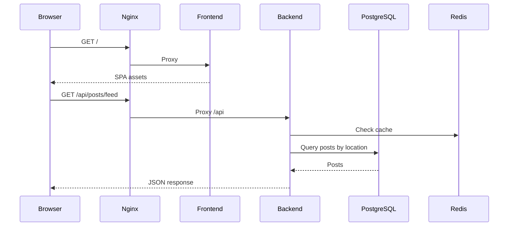

# Architecture Documentation

## System Overview

LocalConnect Maharashtra is a three-tier web application:

1. **Presentation** — React SPA (Vite, TypeScript, Tailwind)
2. **Application** — Node.js Express API + Socket.IO
3. **Data** — PostgreSQL (primary), Redis (cache)

## Request Flow



## Location Scoping

Content visibility is determined by the user's selected society and nearby locations:

```
Maharashtra (state)
  └── Pune (city)
        └── Wakad (area)
              └── Pride Purple Park (society) ← user's location
              └── Green Valley Society (sibling - visible)
```

The `getNearbyLocationIds()` service includes:
- User's society
- Sibling societies in the same area
- Parent area

## Authentication

- **Access token** — JWT, 15 min expiry, sent in `Authorization: Bearer`
- **Refresh token** — JWT, 7 days, stored in DB, used to rotate access tokens
- **Roles** — USER, MODERATOR, ADMIN (hierarchical permissions)

## Real-Time Messaging

Socket.IO connection authenticated via JWT in handshake `auth.token`.

Events:
- `join:conversation` — Join room for a conversation
- `message:send` — Send message, persist to DB, broadcast
- `typing:start` / `typing:stop` — Typing indicators

## Security Layers

| Layer | Implementation |
|-------|----------------|
| Transport | HTTPS (Let's Encrypt on EC2) |
| Headers | Helmet, Nginx security headers |
| Rate limiting | express-rate-limit on `/api` |
| Input validation | Zod schemas |
| SQL injection | Prisma parameterized queries |
| Passwords | bcrypt (12 rounds) |
| CORS | Whitelist frontend origin |

## Database Schema

Key entities:
- `User` — accounts with role and location
- `Location` — hierarchical tree (self-referential)
- `Post`, `Comment`, `Like`, `Bookmark`
- `Conversation`, `Message`
- `MarketplaceItem`
- `Notification`, `Report`
- `Poll`, `PollOption`, `PollVote`

## Deployment Topology

Single EC2 instance — all containers on one Docker bridge network:

| Container | Internal Port | External |
|-----------|---------------|----------|
| nginx | 80 | 80, 443 |
| frontend | 80 | — |
| backend | 4000 | — |
| postgres | 5432 | — (not exposed in prod) |
| redis | 6379 | — |

PostgreSQL data: `postgres_data` Docker volume  
Redis data: `redis_data` Docker volume  
Uploads: `uploads_data` Docker volume
